# Hi, I'm George 👋

### 🎓 CS Student · 🚀 Builder · 🌐 Web & Operations

 
<!-- 我的宠物 -->

[🍖 Feed](https://github.com/LobsterEnigma/LobsterEnigma/issues/new?title=ProfileForge%3A%20feed&body=Just%20press%20%2A%2ACreate%2A%2A.%20Your%20visit%20reaches%20the%20pet%20in%20a%20minute%20or%20two.) · [🛁 Bath](https://github.com/LobsterEnigma/LobsterEnigma/issues/new?title=ProfileForge%3A%20bath&body=Just%20press%20%2A%2ACreate%2A%2A.%20Your%20visit%20reaches%20the%20pet%20in%20a%20minute%20or%20two.) · [🎾 Play](https://github.com/LobsterEnigma/LobsterEnigma/issues/new?title=ProfileForge%3A%20play&body=Just%20press%20%2A%2ACreate%2A%2A.%20Your%20visit%20reaches%20the%20pet%20in%20a%20minute%20or%20two.)

---

## 👨‍💻 About Me

- 🎓 Computer Science student at Queen's University
- 🌐 I build, deploy, and maintain web projects and services
- 🖥️ I enjoy working with servers, deployments, and project infrastructure

---

## ⚙️ Tools & Technologies I Use

 

---

## 🚧 Currently Developing

| Project | Status | About |
| --- | --- | --- |
| **Kexi** | 🟡 In Development | More details coming soon 👀 |

---

## 🌐 Projects & Status

View the current status of my websites, services, and projects.

 

---

<!-- ## 📊 GitHub Stats

---

## 🐍 Contribution Snake

  <picture>
    <source
      media="(prefers-color-scheme: dark)"
      srcset="https://raw.githubusercontent.com/LobsterEnigma/LobsterEnigma/output/github-contribution-grid-snake-dark.svg"
    />
    <source
      media="(prefers-color-scheme: light)"
      srcset="https://raw.githubusercontent.com/LobsterEnigma/LobsterEnigma/output/github-contribution-grid-snake.svg"
    />
    
  </picture>

-->

## 🌃 My City

  

